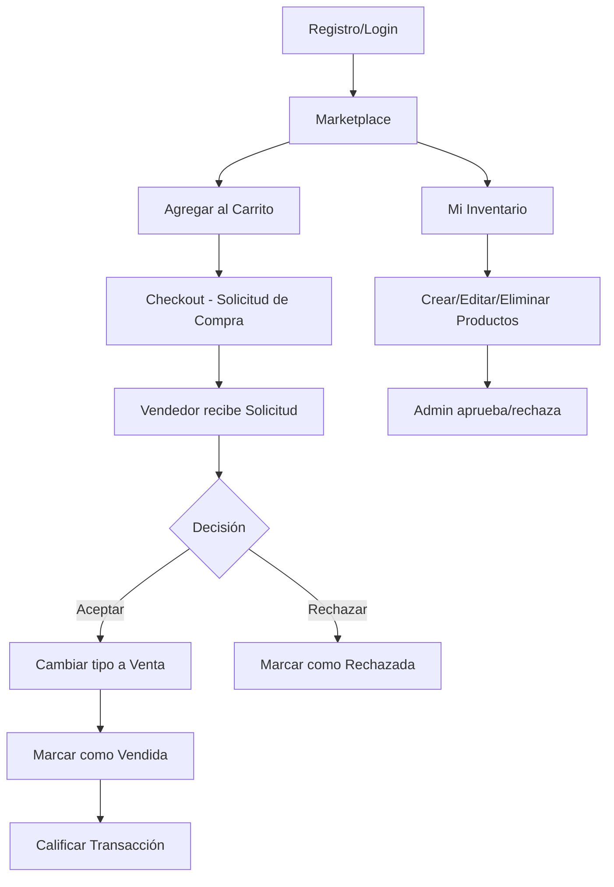

# Visión General del Proyecto

> **AgroSFT** es una plataforma web de marketplace agrícola que conecta productores con compradores, facilitando la comercialización directa de productos del campo.

---

## Ficha Técnica SENA

| Campo | Valor |
|---|---|
| **Título** | AGROSFT |
| **Sector** | Producción de cultivos |
| **Centro** | CTGI (Centro de Tecnologías de la Gestión e Información) |
| **Ficha** | 3109846 |
| **Programa** | TPS / ADSO (Análisis y Desarrollo de Software) |
| **Instructora titular** | Lilliana Uribe G |

### Equipo

| Aprendiz | Rol principal |
|---|---|
| Juan Felipe Quiros Bena | Desarrollo |
| Samuel Pérez Mena | Desarrollo |
| Daniel David Hernandez Baron | Desarrollo |
| Melissa Cabrales Posada | Desarrollo |

### Instructores por competencia

| Instructor | Competencia |
|---|---|
| Lilliana Uribe | Establecimiento de requisitos de software |
| Edilfredo Pineda | Administración de base de datos |
| Hector Maya | Desarrollo de componentes front-end |
| Erika Florez | Implementación de algoritmos y programación |

---

## Propósito

Resolver la problemática de la cadena de suministro agrícola caracterizada por:
- Alta dependencia de intermediarios
- Limitada visibilidad de productos
- Ausencia de herramientas tecnológicas para gestión de oferta y demanda

La plataforma permite **conexión directa** entre agricultores y compradores, sin intermediación, sin pagos integrados — la negociación ocurre fuera de la plataforma.

---

## Objetivos

### General
Desarrollar una plataforma digital que conecte agricultores con compradores y ofrezca herramientas de gestión agrícola (publicación, comunicación y gestión de productos).

### Específicos
1. Diseñar la plataforma con tecnologías web (HTML, CSS, Python, JavaScript, Django)
2. Implementar herramientas de gestión agrícola (inventarios, precios, pedidos en tiempo real)
3. Configurar base de datos MySQL para gestionar usuarios, productos y transacciones
4. Realizar pruebas de usabilidad con al menos 20 usuarios
5. Socializar el proyecto con actores del sector agrícola

---

## Módulos Funcionales

| Módulo | Estado | Descripción |
|---|---|---|
| **Gestión de usuarios** | ✅ Implementado | Registro, login, logout, perfil, contraseña, Google OAuth |
| **Gestión de productos** | ✅ Implementado | CRUD completo con formulario y validación |
| **Marketplace** | ✅ Implementado | Catálogo con filtros, búsqueda, paginación AJAX (Vue) |
| **Carrito de compras** | ✅ Implementado | Sesión + Vue, agregar/actualizar/eliminar |
| **Solicitudes de compra** | 🔄 En refactor | Flujo completo (crear → aceptar/rechazar/vender), migrando a JS puro |
| **Calificaciones** | ✅ Implementado | 1.0–5.0 estrellas, trigger de promedio en BD |
| **Historial de clientes** | ✅ Implementado | Actividad de compradores y vendedores |
| **Términos y condiciones** | ✅ Implementado | Simulados (sin tabla real en BD) |
| **Chat/mensajería** | ❌ Faltante | Mencionado en alcance de ficha, no implementado |
| **Notificaciones** | ❌ Faltante | Solo email backend de consola |
| **Fotos de productos** | ❌ Faltante | La ficha las menciona, no están en el modelo |
| **Ubicación de productos** | ❌ Faltante | Mencionado en alcance, sin campo en modelo |

> [!warning] Brechas críticas
> Ver [[12-BRECHAS-Y-ROADMAP]] para el análisis completo de funcionalidades faltantes.

---

## Flujo Principal del Usuario

---

## Resultados Esperados (Ficha SENA)

| Resultado | Meta |
|---|---|
| Agricultores registrados | 500 en primer año |
| Compradores registrados | 2,000 en primer año |
| Mejores precios para agricultores | 70% reporta mejora |
| Precios justos para compradores | 60% obtiene mejores precios |
| Actualización de stock | 90% agricultores actualizan |
| Calificaciones post-venta | 80% transacciones con reseña (mín 4/5) |

---

## Enlaces Relacionados

- [[02-ARQUITECTURA]] — Cómo está construido el sistema
- [[03-BASE-DATOS]] — Esquema completo de la base de datos
- [[12-BRECHAS-Y-ROADMAP]] — Qué falta implementar
