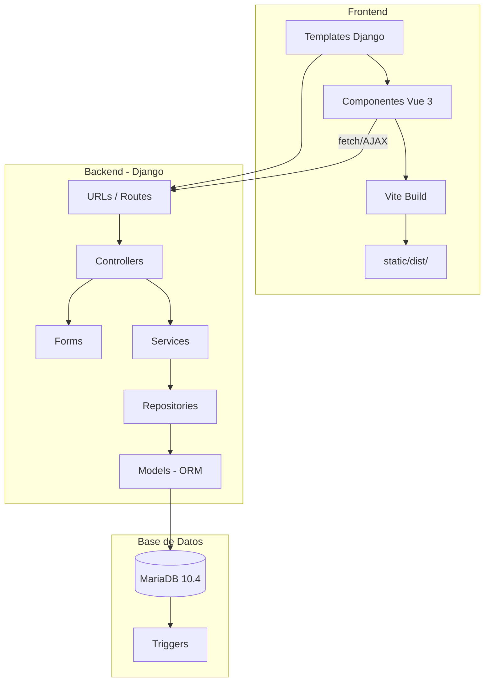
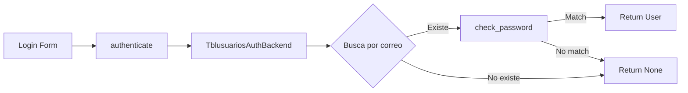

# Arquitectura del Sistema

> AgroSFT sigue una arquitectura **Controller–Service–Repository** adaptada sobre Django, con base de datos legacy MariaDB no gestionada por migraciones.

---

## Diagrama de Capas



---

## Patrón Arquitectónico

El proyecto adapta el patrón **Controller-Service-Repository** sobre la estructura nativa de Django:

```
URL (urls.py)
  → Controller (controllers/*.py)
    → Form (forms/*.py)         — Validación de entrada
    → Service (services/*.py)   — Lógica de negocio
      → Repository (repositories/*.py) — Acceso a datos
        → Model (models/*.py)   — Mapeo ORM a tablas legacy
```

> [!important] Convención de nombres
> - `Controller` = Vista Django (función o clase)
> - `Service` = Lógica de negocio reutilizable
> - `Repository` = Queries complejas encapsuladas

---

## Apps Django

| App | Namespace | Descripción | managed |
|---|---|---|---|
| `apps.usuarios` | `usuarios` | Auth, perfil, términos | `False` |
| `apps.inventario` | `inventario` | Productos, categorías, estados | `False` |
| `apps.ventas` | `ventas` | Carrito, solicitudes, movimientos, calificaciones | `False` |
| `apps.clientes` | `clientes` | Historial de compradores | `False` |
| `core` | — | Clases base, middleware, helpers | — |

> [!warning] Regla fundamental
> **Todos los modelos son `managed = False`**. Django NO crea, modifica ni elimina tablas. La BD se gestiona externamente (scripts SQL, phpMyAdmin, triggers).

---

## Componentes del Core

### `core/models/base_model.py`
Clase abstracta con `created_at`, `updated_at`, `is_active`. Usada como base para modelos propios.

### `core/controllers/base_controller.py`
Extiende `django.views.View` con métodos helper:
- `json_response(data, status)` → JsonResponse
- `get_request_data(request)` → Parsea GET/POST/JSON

### `core/repositories/base_repository.py`
CRUD genérico con paginación usando `Paginator` de Django.

### `core/services/base_service.py`
Validador genérico de campos requeridos.

### `core/middleware.py`
`NoCacheMiddleware` — Agrega headers `Cache-Control` para usuarios autenticados, previene caché del navegador tras cerrar sesión.

### `core/utils/helpers.py`
- `EstadoProducto` — Constantes: Pendiente, Aprobado, Rechazado
- `EstadoSolicitud` — Constantes: pendiente, aceptada, rechazada, vendido, cancelado
- `safe_int(value, default)` — Conversión segura de VARCHAR a int
- `safe_decimal(value, default)` — Conversión segura a float

---

## Autenticación



- **Modelo de usuario**: `usuarios.Tblusuarios` (`AUTH_USER_MODEL`)
- **Backend personalizado**: `TblusuariosAuthBackend` — busca por correo, verifica con `check_password`
- **Google OAuth2**: `social_core.backends.google.GoogleOAuth2` (configurado, claves comentadas)
- **Sesión**: Cache-backed (`django.contrib.sessions.backends.cache`)
- **Expiración**: 30 minutos, expira al cerrar navegador

---

## Frontend Architecture

### Template Base
`templates/base.html` — Layout global con:
- Navbar condicional (auth vs. invitado)
- Sistema de notificaciones toast (Django messages → CSS animations)
- Footer con enlaces

### Componentes Vue 3
Cada módulo frontend tiene su propio entry point compilado por Vite:

```
frontend/src/
├── marketplace/  → MarketApp.vue    (catálogo, filtros, carrito)
├── carrito/      → CarritoApp.vue   (tabla de items, total)
├── inventario/   → InventarioApp.vue (CRUD personal)
├── solicitudes/  → SolicitudApp.vue  (inbox vendedor) ← JS PURO
├── calificaciones/ → CalificacionApp.vue (estrellas interactivas)
└── shared/
    ├── api.js    → Wrapper fetch con CSRF
    └── csrf.js   → Extractor de token CSRF
```

### Patrón de Integración Django ↔ Vue

1. Django renderiza template con datos JSON serializados en contexto:
   ```python
   return render(request, 'template.html', {
       'data_json': json.dumps(marketplace_data)
   })
   ```
2. Template inyecta JSON en `<script type="application/json">`
3. `main.js` lee JSON y monta la app Vue con `createApp(Component, data)`
4. Vue hace `fetch()` AJAX para paginación/filtros/actions

---

## Decisiones Arquitectónicas Clave

| Decisión | Razón |
|---|---|
| `managed = False` en todos los modelos | BD legacy existente con triggers y procedimientos almacenados |
| Sin migraciones Django | `MIGRATION_MODULES = {app: None}` — Schema gestionado externamente |
| Carrito en sesión | Simplicidad, sin tabla adicional necesaria |
| Solicitudes = Movimientos | Reutilizar tablas `movimiento` + `detalle` con `tipo_movimiento` como discriminador |
| Vue como capa SPA parcial | Solo para componentes interactivos, no SPA completa |
| Cache-backed sessions | Evita tabla `django_session` en BD legacy |

---

## Seguridad Implementada

| Capa | Mecanismo |
|---|---|
| CSRF | Middleware Django + token en fetch AJAX |
| XSS | `SECURE_BROWSER_XSS_FILTER = True` |
| Clickjacking | `X_FRAME_OPTIONS = 'DENY'` |
| Content type | `SECURE_CONTENT_TYPE_NOSNIFF = True` |
| Contraseñas | `make_password()` / `check_password()` (hashers Django) |
| Sesión | `NoCacheMiddleware` previene caché post-logout |
| SSL (producción) | HSTS, redirect HTTPS, cookies secure (solo `DEBUG=False`) |

---

## Enlaces Relacionados

- [[00-INDEX]] — Volver al índice
- [[03-BASE-DATOS]] — Detalle del esquema de BD
- [[08-FRONTEND]] — Componentes Vue en detalle
- [[09-CONFIGURACION]] — Cómo configurar el entorno
