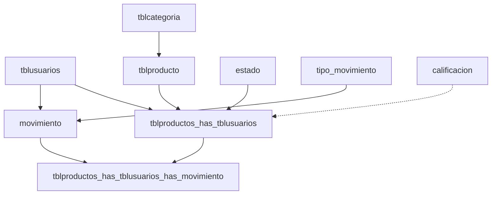

# Base de Datos

> MariaDB 10.4 legacy — Django NO gestiona el schema. Todos los modelos son `managed = False`.

---

## Diagrama Entidad-Relación

---

## Tablas Principales

### `tblusuarios` — Usuarios del Sistema

| Columna | Tipo | Django Field | Descripción |
|---|---|---|---|
| `id_users` | INT AUTO_INCREMENT | `AutoField` (PK) | Identificador único |
| `nombres` | VARCHAR(45) | `CharField` | Nombres del usuario |
| `apellidos` | VARCHAR(45) | `CharField` | Apellidos del usuario |
| `Telefono` | VARCHAR(45) | `CharField` | Teléfono (nullable) |
| `correo` | VARCHAR(45) UNIQUE | `CharField` | Email (USERNAME_FIELD) |
| `contraseña` | VARCHAR(255) | `CharField` | Hash de contraseña |
| `fecha_creacion` | DATETIME | `DateTimeField` | Auto al crear |
| `last_login` | DATETIME | `DateTimeField` | Último acceso |
| `is_superuser` | BOOLEAN | `BooleanField` | Es superusuario |
| `is_staff` | BOOLEAN | `BooleanField` | Es staff |
| `is_active` | BOOLEAN | `BooleanField` | Cuenta activa |

**Modelo Django**: `apps.usuarios.models.profile_model.Tblusuarios`
- `AUTH_USER_MODEL = 'usuarios.Tblusuarios'`
- `USERNAME_FIELD = 'correo'`
- Manager: `TblusuariosManager(BaseUserManager)`

---

### `tblcategoria` — Categorías de Productos

| Columna | Tipo | Django Field | Descripción |
|---|---|---|---|
| `idt_categoria` | INT AUTO_INCREMENT | `AutoField` (PK) | ID categoría |
| `categoria` | VARCHAR(45) | `CharField` | Nombre de categoría |
| `descripcion` | TEXT | `TextField` | Descripción (nullable) |
| `activo` | BOOLEAN | `BooleanField` | Activa/inactiva |
| `created_at` | DATETIME | `DateTimeField` | Fecha creación |
| `updated_at` | DATETIME | `DateTimeField` | Fecha actualización |

**Categorías predefinidas**: Frutas, Verduras, Tubérculos, Granos y Cereales, Insumos Agrícolas

---

### `tblproducto` — Catálogo Maestro de Productos

| Columna | Tipo | Django Field | Descripción |
|---|---|---|---|
| `id_productos` | INT AUTO_INCREMENT | `AutoField` (PK) | ID producto |
| `nombre` | VARCHAR(45) | `CharField` | Nombre del producto |
| `descripcion` | TEXT | `TextField` | Descripción (nullable) |
| `cantidad` | INT | `IntegerField` | Stock global (calculado) |
| `fecha_creacion` | DATETIME | `DateTimeField` | Auto al crear |
| `tblcategoria_idt_categoria` | INT (FK) | `ForeignKey` | Categoría |
| `stock_minimo` | INT | `IntegerField` | Alerta stock mínimo |
| `estado` | VARCHAR(20) | `CharField` | Estado del producto |
| `eliminado` | BOOLEAN | `BooleanField` | Soft delete flag |
| `fecha_eliminacion` | DATETIME | `DateTimeField` | Cuándo se eliminó |
| `eliminado_por_id` | INT | `IntegerField` | Quién eliminó |
| `updated_at` | DATETIME | `DateTimeField` | Última modificación |

> [!note] Catálogo unificado
> Esta tabla es el **catálogo genérico**. Los datos específicos por vendedor (precio, stock propio) están en `tblproductos_has_tblusuarios`.

---

### `tblproductos_has_tblusuarios` — Publicaciones por Vendedor

| Columna | Tipo | Django Field | Descripción |
|---|---|---|---|
| `id_pd_us` | INT AUTO_INCREMENT | `AutoField` (PK) | ID publicación |
| `tblproductos_id_productos` | INT (FK) | `ForeignKey` | Producto maestro |
| `tblusuarios_id_users` | INT (FK) | `ForeignKey` | Vendedor |
| `Estado_id_estado` | INT (FK) | `ForeignKey` | Estado de publicación |
| `cantidad` | DECIMAL(10,2) | `DecimalField` | Stock del vendedor |
| `fecha_creacion` | DATETIME | `DateTimeField` | Fecha publicación |
| `precio` | DECIMAL(10,2) | `DecimalField` | Precio por vendedor |
| `calificacion_promedio` | DECIMAL(3,1) | `DecimalField` | Promedio (actualizado por trigger) |

> [!important] Trigger de stock
> La columna `cantidad` es actualizada automáticamente por el trigger `trg_actualizar_stock_oferta` al insertar registros en la tabla de detalle de movimientos. **NO restar stock manualmente en código Python.**

---

### `estado` — Estados de Publicación

| Columna | Tipo | Descripción |
|---|---|---|
| `id_estado` | INT AUTO_INCREMENT (PK) | ID estado |
| `estado` | VARCHAR(45) | Nombre del estado |

**Valores**: Pendiente, Aprobado, Rechazado

---

### `tipo_movimiento` — Tipos de Transacción

| Columna | Tipo | Descripción |
|---|---|---|
| `id_tipo_movimiento` | INT AUTO_INCREMENT (PK) | ID tipo |
| `tipo_movimiento` | VARCHAR(45) | Nombre del tipo |

**Valores conocidos**:
- `compra` (id=1) → Solicitud de compra (comprador envía al vendedor)
- `venta` (id=2) → Solicitud aceptada / venta en proceso / abastecimiento
- `vendida` (id=3) → Transacción completada
- `rechazada` (id=4) → Solicitud rechazada por vendedor
- `cancelada` (id=5) → Venta cancelada (desde estado `venta`)

---

### `movimiento` — Header de Transacciones

| Columna | Tipo | Django Field | Descripción |
|---|---|---|---|
| `id_movimiento` | INT AUTO_INCREMENT | `AutoField` (PK) | ID movimiento |
| `tipo_movimiento_id_tipo_movimiento` | INT (FK) | `ForeignKey` | Tipo de movimiento |
| `tblusuarios_id_users` | INT (FK) | `ForeignKey` | Usuario que genera el movimiento |

> [!note] Fecha del movimiento
> Esta tabla **NO tiene campo de fecha**. La fecha está en `tblproductos_has_tblusuarios_has_movimiento.fecha_movimiento`.

---

### `tblproductos_has_tblusuarios_has_movimiento` — Detalle de Transacción

| Columna | Tipo | Django Field | Descripción |
|---|---|---|---|
| `id_movimiento_usuario` | INT AUTO_INCREMENT | `AutoField` (PK) | ID detalle |
| `tblproductos_has_tblusuarios_id_pd_us` | INT (FK) | `ForeignKey` | Publicación específica |
| `movimiento_id_movimiento` | INT (FK) | `ForeignKey` | Movimiento header |
| `cantidad` | DECIMAL(10,2) | `DecimalField` | Cantidad (+entrada, -salida) |
| `calificacion` | DECIMAL(3,1) | `DecimalField` | Rating 1.0-5.0 (nullable) |
| `fecha_movimiento` | DATETIME | `DateTimeField` | Fecha de la transacción |

**Convención de signos**:
- `cantidad > 0` → Entrada/abastecimiento de stock
- `cantidad < 0` → Salida/venta de stock

---

### `calificacion` — Tabla de Referencia

| Columna | Tipo | Descripción |
|---|---|---|
| `id_calificacion` | INT AUTO_INCREMENT (PK) | ID |
| `calificacion` | INT | Valor de referencia |

> [!note]
> Tabla de referencia con un solo registro (valor 5). Las calificaciones reales se almacenan en `ProductoUsuarioMovimiento.calificacion`.

---

## Tablas Extendidas (Solo Django — Inexistentes en MariaDB)

> [!warning] Las siguientes tablas existen como modelos Django (`managed = False`) pero **no están creadas** en la base de datos MariaDB real. No son funcionales.

### `user_profiles` — Perfil Extendido

| Columna | Django Field | Descripción |
|---|---|---|
| `id_perfil` | `AutoField` (PK) | ID perfil |
| `id_usuario` | `IntegerField` | FK directa a tblusuarios |
| `imagen_perfil` | `ImageField` | Foto de perfil |
| `biografia` | `TextField` | Biografía |
| `sitio_web` | `URLField` | Sitio web |
| `telefono_contacto` | `CharField` | Teléfono alternativo |
| `notificaciones_activas` | `BooleanField` | Preferencia |
| `idioma_preferido` | `CharField` | Default: 'es' |
| `zona_horaria` | `CharField` | Default: 'America/Bogota' |

### `user_devices` — Dispositivos del Usuario (Inexistente en BD)
### `user_addresses` — Direcciones del Usuario (Inexistente en BD)

---

## Triggers de Base de Datos (5 activos)

| Trigger | Evento | Acción |
|---|---|---|
| `trg_actualizar_stock_oferta` | AFTER INSERT en detalles | Si tipo != 'compra': `stock += cantidad`. Ignora solicitudes 'compra'. Incluye protección stock negativo |
| `trg_descontar_stock_vendida` | AFTER UPDATE en movimiento | Si tipo cambia a `'vendida'`: `stock -= ABS(cantidad)` |
| `trg_actualizar_calificacion_promedio` | AFTER INSERT en detalles | Recalcula calificación promedio al insertar |
| `trg_actualizar_calificacion_promedio_update` | AFTER UPDATE en detalles | Recalcula calificación promedio al actualizar |
| `trg_actualizar_calificacion_promedio_delete` | AFTER DELETE en detalles | Recalcula calificación promedio al eliminar |

> [!danger] NO duplicar lógica de triggers en Python
> El stock y el promedio de calificaciones son gestionados por triggers de BD. Restar manualmente en Python causaría doble-descuento.

> [!warning] Flujo de stock actual
> | Paso | tipo_movimiento | ¿Afecta stock? |
> |---|---|---|
> | Checkout (comprador) | `'compra'` | ❌ No (trigger ignora) |
> | Aceptar (vendedor) | `'venta'` | ❌ No (UPDATE, no INSERT) |
> | Marcar vendido | `'vendida'` | ✅ Stock -= ABS(cantidad) |
> | Rechazar | `'rechazada'` | ❌ No |
> | Cancelar | `'cancelada'` | ❌ No |
> | Abastecimiento | `'venta'` | ✅ Stock += cantidad positiva |

---

## Consideraciones de Desarrollo

1. **Nunca ejecutar `python manage.py makemigrations`** — Los modelos son de solo lectura para Django
2. **Nunca ejecutar `python manage.py migrate`** para apps propias — Solo para tablas internas de Django
3. **Cambios al schema** → Hacer directamente en MariaDB (phpMyAdmin, scripts SQL)
4. **Sincronizar modelos** → Después de cambiar la BD, actualizar el modelo Django manualmente
5. **`db_column`** → Cada campo del modelo debe coincidir exactamente con el nombre de columna en BD

---

## Enlaces Relacionados

- [[00-INDEX]] — Volver al índice
- [[05-MODULO-INVENTARIO]] — Cómo se usan estos modelos
- [[06-MODULO-VENTAS]] — Flujo de movimientos y transacciones
