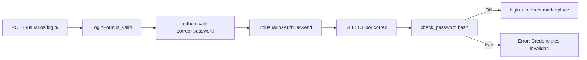

# Módulo Usuarios

> Gestión completa de autenticación, registro, perfil y términos y condiciones.

**App**: `apps.usuarios` | **Namespace**: `usuarios` | **URL prefix**: `/usuarios/`

---

## Estructura de Archivos

```
apps/usuarios/
├── controllers/
│   ├── auth_controller.py      → Registro, login, logout, perfil, contraseña
│   └── terminos_controller.py  → Términos y condiciones
├── forms/
│   └── auth_forms.py           → RegistroForm, LoginForm, PerfilForm, etc.
├── models/
│   ├── profile_model.py        → Tblusuarios, UserProfile, UserDevice, UserAddress
│   └── terminos_model.py       → Termino, AceptacionTermino (simulados)
├── services/
│   └── terminos_service.py     → Lógica de aceptación de términos
├── backends.py                 → TblusuariosAuthBackend
├── pipeline.py                 → Custom pipeline para Google OAuth
└── urls.py                     → Rutas del módulo
```

---

## Autenticación

### Flujo de Login



### Backend Personalizado

`TblusuariosAuthBackend` (`apps/usuarios/backends.py`):
- Busca usuario por `correo` (campo `USERNAME_FIELD`)
- Verifica contraseña con `check_password()` de Django
- Incluye validación defensiva: verifica si tabla/columna existen antes de consultar
- `get_user(user_id)` → busca por `id_users` (PK custom)

### Sesión
- Engine: `django.contrib.sessions.backends.cache` (en memoria)
- Cookie age: 1800 segundos (30 min)
- Expira al cerrar navegador: `SESSION_EXPIRE_AT_BROWSER_CLOSE = True`

---

## Vistas (Controllers)

### RegistroView
- **GET**: Muestra formulario de registro
- **POST**: Valida y crea usuario con `make_password()`
- Verifica existencia de tabla `tblusuarios` antes de operar
- Form: `RegistroTblusuariosForm` (hereda de `forms.Form`)
- Valida: correo único, contraseñas coinciden, mín 8 caracteres

### LoginView
- **GET**: Muestra formulario de login
- **POST**: Autentica con backend personalizado
- Redirige a `inventario:marketplace` o URL `next`
- Intenta actualizar `ultima_conexion` (campo que puede no existir)

### LogoutView
- Soporta GET y POST (para enlaces `<a>` directos)
- Redirige a `usuarios:login`

### PerfilView
- **GET**: Muestra formulario con datos del usuario + perfil (imagen)
- **POST**: Actualiza datos, maneja subida/eliminación de imagen de perfil
- Soporta respuesta AJAX (`JsonResponse`) y normal (redirect)

### CambiarPasswordView
- Verifica contraseña actual, valida que nueva y confirmación coincidan
- Usa `set_password()` + `save()`

### Password Reset (parcial)
- `UserPasswordResetView` → Muestra formulario de email (sin envío real)
- `UserPasswordResetConfirmView` → Formulario de nueva contraseña (sin lógica de token)
- **No implementado**: envío real de email, verificación de token

---

## Términos y Condiciones

Implementación simulada sin tabla de BD:

- `Termino` → Clase POJO con datos estáticos (v1.1.0)
- `TerminosService` → Servicio que maneja aceptación vía caché (30 días)
- `AceptacionTermino` → Objeto en memoria, no persistente
- Aceptación se almacena en `cache` con key `user_{id}_acepto_terminos`

---

## Formularios

| Form | Tipo | Campos |
|---|---|---|
| `RegistroTblusuariosForm` | `forms.Form` | nombres, apellidos, telefono, correo, password1, password2 |
| `LoginForm` | `forms.Form` | username (correo), password |
| `PerfilForm` | `forms.ModelForm` | nombres, apellidos, telefono, correo |
| `CustomUserCreationForm` | `UserCreationForm` | Para admin de Django |

---

## Modelos

### Tblusuarios (AUTH_USER_MODEL)
- **PK**: `id_users` (AutoField)
- **Login**: `correo` (unique)
- **Password**: campo `contraseña` (hash Django)
- Propiedades requeridas por Django: `is_anonymous`, `is_authenticated`, `has_perm`, `has_module_perms`

### UserProfile
- Relación 1:1 por `id_usuario` (IntegerField, no FK)
- Método `get_or_create_for_user(user)` → crea perfil si no existe
- Manejo de imagen con `ImageField` → `profile_pictures/`

### TemporalUsuario
> [!danger] Clase de respaldo
> Simula un usuario si la tabla no existe. `check_password()` siempre retorna `True`. **No usar en producción.**

---

## Google OAuth2

Configurado pero con claves comentadas en `settings.py`:
```python
# SOCIAL_AUTH_GOOGLE_OAUTH2_KEY = ''
# SOCIAL_AUTH_GOOGLE_OAUTH2_SECRET = ''
```

Pipeline personalizado en `apps/usuarios/pipeline.py` → `create_user_custom` maneja campos de `Tblusuarios`.

---

## Rutas

| URL | Name | Método | Descripción |
|---|---|---|---|
| `/usuarios/login/` | `usuarios:login` | GET/POST | Iniciar sesión |
| `/usuarios/registro/` | `usuarios:registro` | GET/POST | Registro |
| `/usuarios/logout/` | `usuarios:logout` | GET/POST | Cerrar sesión |
| `/usuarios/perfil/` | `usuarios:perfil` | GET/POST | Ver/editar perfil |
| `/usuarios/cambiar-password/` | `usuarios:cambiar_password` | GET/POST | Cambiar contraseña |
| `/usuarios/terminos/` | `usuarios:terminos` | GET | Ver términos |
| `/usuarios/aceptar-terminos/` | `usuarios:aceptar-terminos` | POST | Aceptar términos |
| `/usuarios/historial/` | `usuarios:historial` | GET | Historial de términos |
| `/usuarios/password-reset/` | `usuarios:password_reset` | GET/POST | Reset contraseña |

---

## Enlaces Relacionados

- [[00-INDEX]] — Volver al índice
- [[03-BASE-DATOS#tblusuarios]] — Schema de tabla de usuarios
- [[02-ARQUITECTURA#Autenticación]] — Diagrama de autenticación
