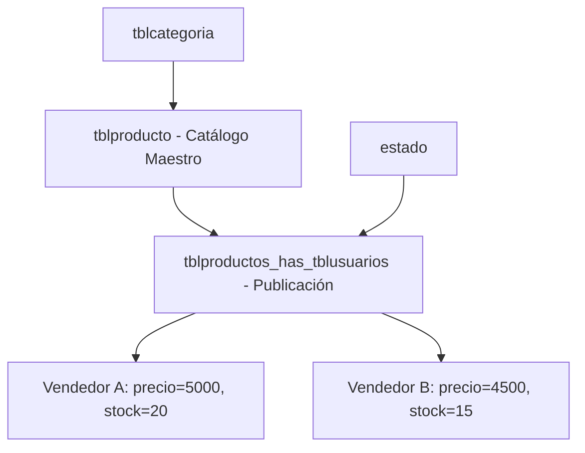

# Módulo Inventario

> Catálogo de productos, gestión CRUD por vendedor, marketplace y flujo de aprobación.

**App**: `apps.inventario` | **Namespace**: `inventario` | **URL prefix**: `/inventario/`

---

## Estructura de Archivos

```
apps/inventario/
├── controllers/
│   └── producto_controller.py  → Listar, marketplace, crear, editar, eliminar, aprobar, rechazar
├── forms/
│   └── producto_form.py        → ProductoForm, ProductoBusquedaForm
├── models/
│   ├── __init__.py             → Export: Categoria, Producto, ProductoUsuario, Estado, TipoMovimiento, Calificacion
│   └── producto.py             → Todos los modelos del módulo
├── repositories/
│   ├── base_repository.py      → CRUD genérico
│   └── producto_repository.py  → Queries especializadas de productos
├── views/
│   └── producto_views.py       → Vistas genéricas de Django (re-exportadas)
└── urls.py
```

---

## Arquitectura Dual de Producto

El sistema usa un modelo de **catálogo unificado + publicaciones por vendedor**:



- **Producto** = Entidad genérica (nombre, descripción, categoría)
- **ProductoUsuario** = Publicación específica (precio, stock, estado por vendedor)

---

## Vistas (Controllers)

### `listar_productos` — Mi Inventario
- Muestra **solo** productos del usuario actual
- Filtros: búsqueda por nombre, categoría, ordenamiento (precio, nombre, reciente)
- Paginación: 10 por página
- Respuesta dual: HTML (template) o JSON (AJAX)
- Vue: `InventarioApp.vue` con botones Editar/Eliminar

### `marketplace` — Inicio / Productos de Otros
- Muestra productos **aprobados** de **otros usuarios** (excluye los propios)
- Filtros: búsqueda, categoría, ordenamiento
- Paginación: 12 por página
- Vue: `MarketApp.vue` con botones "Ver Detalle" y "Añadir al carrito"

### `crear_producto`
1. Valida formulario `ProductoForm`
2. Busca/crea producto en catálogo maestro (`get_or_create` por nombre)
3. Crea `ProductoUsuario` con precio, estado=Pendiente, stock=0
4. Si cantidad > 0, crea `Movimiento` + `ProductoUsuarioMovimiento` inicial
5. Stock actualizado por trigger de BD

### `editar_producto`
1. Verifica propiedad (dueño o admin)
2. Actualiza producto maestro (nombre, descripción, categoría, stock_minimo)
3. Calcula diferencia de stock: `diferencia = nueva_cantidad - cantidad_actual`
4. Actualiza ProductoUsuario (precio, estado)
5. Si hubo cambio de stock, registra movimiento de ajuste
6. Todo dentro de `transaction.atomic()`

### `eliminar_producto`
- Verifica propiedad (dueño o admin)
- **Eliminación física** del `ProductoUsuario` (no soft-delete)
- Soporta AJAX y POST normal

### `aprobar_producto` / `rechazar_producto`
- Solo usuarios `is_staff`
- Cambia `id_estado` del ProductoUsuario
- Registra acción en `ProductoRepository.log_action()`

### `api_verificar_stock`
- Endpoint AJAX: retorna stock, disponibilidad, stock mínimo
- Sin autenticación requerida

---

## Formularios

### ProductoForm (`forms.Form`)

| Campo | Tipo | Descripción |
|---|---|---|
| `nombre` | CharField(45) | Nombre del producto |
| `descripcion` | CharField | Descripción (opcional) |
| `id_categoria` | ModelChoiceField | Categoría activa |
| `stock_minimo` | IntegerField | Mínimo para alerta (opcional) |
| `cantidad` | IntegerField | Stock (solo enteros, step=1) |
| `precio` | DecimalField(10,2) | Precio por unidad |
| `id_estado` | ModelChoiceField | Estado (opcional, para edición) |

> [!note] Cantidad es IntegerField
> Aunque el modelo BD es `DecimalField(10,2)`, el formulario fuerza enteros con `step=1` y `min_value=0`.

---

## Repository

`ProductoRepository` (`producto_repository.py`) provee:

| Método | Descripción |
|---|---|
| `get_by_filters(estado, categoria, nombre)` | Query con filtros combinados |
| `get_productos_by_estado(estado)` | Filtrar por estado |
| `get_productos_by_agricultor(usuario)` | Productos de un vendedor |
| `get_producto_detalle(id)` | Detalle con select_related |
| `get_paginated(page, per_page, filters)` | Paginación |
| `create(data, user_id)` | Crear ProductoUsuario |
| `update(id, data, user_id)` | Actualizar campos |
| `delete(id, user)` | Soft delete (marca `eliminado=True` en Producto) |
| `restore(id)` | Restaurar producto eliminado |
| `log_action(...)` | Placeholder para historial (sin implementar) |

---

## Caché

| Key | Duración | Contenido |
|---|---|---|
| `categorias_activas` | 1 hora | Lista de categorías activas |
| `estados_producto` | 1 hora | Lista de estados posibles |

Funciones: `get_categorias_cached()`, `get_estados_cached()`

---

## Rutas

| URL | Name | Descripción |
|---|---|---|
| `/inventario/` | `inventario:listar` | Mi Inventario (mis productos) |
| `/inventario/marketplace/` | `inventario:marketplace` | Productos de otros (Inicio) |
| `/inventario/producto/<pk>/` | `inventario:detalle` | Detalle de producto |
| `/inventario/producto/nuevo/` | `inventario:crear` | Crear producto |
| `/inventario/producto/<pk>/editar/` | `inventario:editar` | Editar producto |
| `/inventario/producto/<pk>/eliminar/` | `inventario:eliminar` | Eliminar producto |
| `/inventario/producto/<id>/aprobar/` | `inventario:aprobar` | Aprobar (admin) |
| `/inventario/producto/<id>/rechazar/` | `inventario:rechazar` | Rechazar (admin) |
| `/inventario/api/producto/<id>/stock/` | `inventario:api_stock` | API stock |

---

## Enlaces Relacionados

- [[00-INDEX]] — Volver al índice
- [[03-BASE-DATOS#tblproducto]] — Schema de productos
- [[03-BASE-DATOS#tblproductos_has_tblusuarios]] — Schema de publicaciones
- [[08-FRONTEND#InventarioApp.vue]] — Componente Vue del inventario
