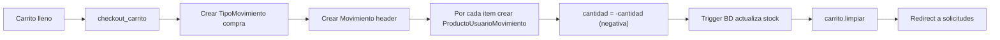
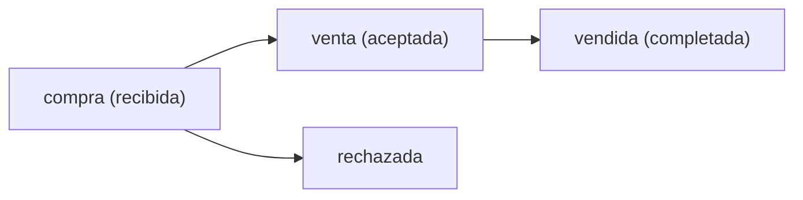

# Módulo Ventas

> Carrito de compras, solicitudes de compra (JS puro), ventas y calificaciones.

**App**: `apps.ventas` | **Namespace**: `ventas` | **URL prefix**: `/ventas/`

---

## Estructura de Archivos

```
apps/ventas/
├── controllers/
│   ├── carrito_controller.py       → CRUD carrito + checkout
│   ├── solicitud_controller.py     → Inbox vendedor (aceptar/rechazar/vender)
│   ├── venta_controller.py         → Listado de ventas
│   └── calificacion_controller.py  → Calificar transacción + historial
├── forms/
│   └── calificacion_form.py        → Form de rating 1.0–5.0
├── models/
│   ├── movimiento.py               → Movimiento, ProductoUsuarioMovimiento, TipoMovimiento
│   ├── solicitud.py                → OBSOLETO (SolicitudCompra, DetalleSolicitudCompra)
│   └── venta.py                    → OBSOLETO (Venta, DetalleVenta)
├── services/
│   └── carrito_service.py          → Clase Carrito basada en sesión
└── urls.py
```

---

## 1. Carrito de Compras

### Service: `Carrito` (carrito_service.py)

Almacenamiento en **sesión de Django** (`request.session['carrito']`):

```python
# Estructura interna
{
    "123": {"cantidad": 2, "precio": "5000.00"},
    "456": {"cantidad": 1, "precio": "3500.00"},
}
```

| Método | Descripción |
|---|---|
| `agregar(producto, cantidad)` | Añade o incrementa item |
| `actualizar(producto_id, cantidad)` | Cambia cantidad (elimina si <= 0) |
| `eliminar(producto_id)` | Remueve item |
| `limpiar()` | Vacía carrito |
| `__iter__()` | Itera items con objetos ProductoUsuario hidratados |
| `__len__()` | Total de unidades |
| `get_total_precio()` | Suma de precios × cantidades |

### Controller: carrito_controller.py

| Vista | Descripción |
|---|---|
| `detalle_carrito` | Renderiza tabla con items + JSON para Vue |
| `agregar_al_carrito` | POST: añade producto con validación de stock |
| `actualizar_carrito` | POST: cambia cantidad con validación de stock |
| `eliminar_del_carrito` | POST: remueve del carrito |
| `checkout_carrito` | Crea Movimiento tipo "compra" con detalles |
| `checkout_venta_carrito` | Deshabilitado (placeholder) |

> [!warning] Sin @login_required
> Las vistas `detalle_carrito`, `agregar_al_carrito`, `actualizar_carrito`, `eliminar_del_carrito` **no tienen `@login_required`**. El carrito funciona con sesión anónima.

### Checkout Flow



> [!important] Stock automático
> El trigger `trg_actualizar_stock_oferta` descuenta stock al insertar en `ProductoUsuarioMovimiento`. **NO** restar manualmente en Python.

---

## 2. Solicitudes de Compra

### Diseño

Las solicitudes **NO usan tablas propias**. Reutilizan las tablas de movimiento:

| Concepto | Implementación |
|---|---|
| Solicitud de compra | `Movimiento` con `tipo_movimiento.tipo = 'compra'` |
| Detalles de solicitud | `ProductoUsuarioMovimiento` vinculado al movimiento |
| Estado de solicitud | Discriminado por `tipo_movimiento.tipo` |

### Estados de Solicitud



| tipo_movimiento | Estado lógico | Significado |
|---|---|---|
| `compra` | Recibida | Comprador envió solicitud |
| `venta` | Aceptada | Vendedor aceptó, en proceso |
| `rechazada` | Rechazada | Vendedor rechazó |
| `vendida` | Completada | Transacción finalizada |

### Controller: solicitud_controller.py

| Vista | Descripción |
|---|---|
| `listar_solicitudes` | Inbox del vendedor: solicitudes que incluyen MIS productos |
| `detalle_solicitud` | Detalle con productos míos en la solicitud |
| `aceptar_solicitud` | Cambia tipo_movimiento de 'compra' a 'venta' |
| `rechazar_solicitud` | Cambia tipo_movimiento a 'rechazada' |
| `marcar_vendido` | Cambia tipo_movimiento de 'venta' a 'vendida' |
| `estado_detalle` | Placeholder para estado por producto individual |

### Frontend: SolicitudApp.vue

> [!important] Módulo JavaScript Puro (COMPLETADO)
> El componente `SolicitudApp.vue` funciona **sin conexión a base de datos**. Todas las acciones (aceptar, rechazar, marcar vendida) operan sobre el estado local Vue. Los datos se cargan desde:
> 1. **JSON inyectado por Django** (si existe `#solicitudes-data` en el template)
> 2. **Datos mock locales** (fallback automático si no hay datos del servidor)
>
> **No requiere `csrf.js`** ni llamadas `fetch()` al backend.
> `main.js` monta el componente sin props: `createApp(SolicitudApp).mount(el)`

**Características del componente**:
- Stats cards con contadores por estado (total, recibidas, aceptadas, rechazadas, vendidas)
- Filtro por estado, búsqueda por nombre/email/ID, ordenamiento
- Modal de detalle con desglose de productos
- Notificaciones toast para feedback
- Transiciones CSS suaves

---

## 3. Ventas

### Controller: venta_controller.py

| Vista | Descripción |
|---|---|
| `listar_ventas` | Lista movimientos tipo 'venta'/'vendida' que contienen mis productos |
| `detalle_venta` | Detalle de una venta específica |
| `crear_venta` | Redirige a solicitudes ("acepta una solicitud para crear venta") |

### Cálculo de totales
- La cantidad en `ProductoUsuarioMovimiento` es **negativa** para ventas
- Total = `sum(abs(cantidad) * precio)` 

---

## 4. Calificaciones

### Controller: calificacion_controller.py

| Vista | Descripción |
|---|---|
| `calificar_transaccion` | Rating interactivo de 1.0–5.0 (pasos de 0.5) |
| `historial_movimientos` | Lista todos los movimientos del usuario |

### Form: CalificacionForm
- Campo: `calificacion` (DecimalField 3,1)
- Validación: entre 1.0 y 5.0, múltiplo de 0.5
- El trigger de BD actualiza `calificacion_promedio` en `ProductoUsuario`

### Frontend: CalificacionApp.vue
- Estrellas interactivas con hover
- Click para seleccionar (1-5)
- Submit AJAX con CSRF
- Estado de "ya calificado" bloquea re-calificación

---

## Modelos Obsoletos

> [!danger] NO USAR
> `SolicitudCompra`, `DetalleSolicitudCompra`, `Venta`, `DetalleVenta` apuntan a tablas inexistentes. Solo mantenidos por compatibilidad. Todo el nuevo código debe usar `Movimiento` + `ProductoUsuarioMovimiento`.

---

## Rutas

| URL | Name | Descripción |
|---|---|---|
| `/ventas/carrito/` | `ventas:carrito_detalle` | Ver carrito |
| `/ventas/carrito/agregar/<id>/` | `ventas:carrito_agregar` | Añadir al carrito |
| `/ventas/carrito/actualizar/<id>/` | `ventas:carrito_actualizar` | Cambiar cantidad |
| `/ventas/carrito/eliminar/<id>/` | `ventas:carrito_eliminar` | Remover item |
| `/ventas/carrito/checkout/` | `ventas:carrito_checkout` | Crear solicitud |
| `/ventas/carrito/checkout-venta/` | `ventas:carrito_checkout_venta` | Venta directa (deshabilitado) |
| `/ventas/` | `ventas:venta_list` | Listar ventas |
| `/ventas/<pk>/` | `ventas:venta_detail` | Detalle de venta |
| `/ventas/solicitudes/` | `ventas:solicitud_list` | Inbox de solicitudes |
| `/ventas/solicitudes/<pk>/` | `ventas:solicitud_detail` | Detalle solicitud |
| `/ventas/solicitudes/<pk>/aceptar/` | `ventas:solicitud_aceptar` | Aceptar solicitud |
| `/ventas/solicitudes/<pk>/rechazar/` | `ventas:solicitud_rechazar` | Rechazar solicitud |
| `/ventas/solicitudes/<pk>/vendido/` | `ventas:solicitud_marcar_vendido` | Marcar vendida |
| `/ventas/calificaciones/calificar/<id>/` | `ventas:calificar_transaccion` | Calificar |
| `/ventas/calificaciones/historial/` | `ventas:historial_movimientos` | Historial |

---

## Enlaces Relacionados

- [[00-INDEX]] — Volver al índice
- [[03-BASE-DATOS#movimiento]] — Schema de movimientos
- [[03-BASE-DATOS#tblproductos_has_tblusuarios_has_movimiento]] — Schema de detalles
- [[08-FRONTEND#CarritoApp.vue]] — Componente Vue del carrito
- [[08-FRONTEND#SolicitudApp.vue]] — Componente Vue de solicitudes
