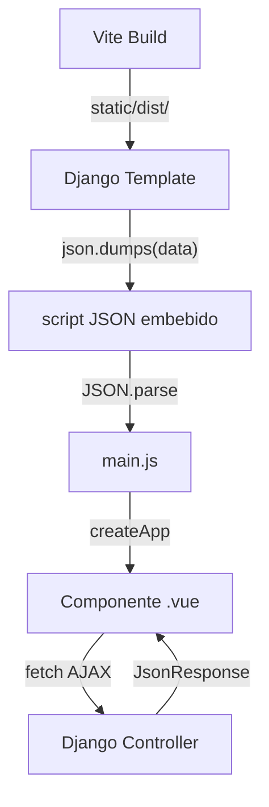

# Frontend — Vue 3 + Vite

> Componentes interactivos SPA parciales integrados con Django templates.

---

## Arquitectura



### Flujo de Integración

1. **Django** serializa datos en el controller: `json.dumps(data)`
2. **Template** inyecta JSON: `<script id="data" type="application/json">{{ json_data }}</script>`
3. **main.js** monta la app: `createApp(Component, JSON.parse(data)).mount('#el')`
4. **Vue** hace `fetch()` para acciones interactivas (filtros, paginación, CRUD)

---

## Entry Points (Vite)

Definidos en `vite.config.js`:

| Entry | Archivo | Componente |
|---|---|---|
| `marketplace` | `frontend/src/marketplace/main.js` | `MarketApp.vue` |
| `carrito` | `frontend/src/carrito/main.js` | `CarritoApp.vue` |
| `inventario` | `frontend/src/inventario/main.js` | `InventarioApp.vue` |
| `solicitudes` | `frontend/src/solicitudes/main.js` | `SolicitudApp.vue` |
| `calificaciones` | `frontend/src/calificaciones/main.js` | `CalificacionApp.vue` |

---

## Componentes

### MarketApp.vue — Marketplace

**Props**: `initialProducts`, `categories`, `urls`

**Funcionalidades**:
- Búsqueda por texto (reactiva con `watch`)
- Filtro por categoría (select)
- Ordenamiento (reciente, precio asc/desc, nombre)
- Paginación AJAX (12 por página)
- Añadir al carrito (POST con CSRF)
- Formato de precio COP (`Intl.NumberFormat`)
- Badges: Agotado, Últimas unidades
- Hover cards con animación CSS

**Fetch pattern**:
```javascript
async function fetchProducts() {
  const res = await fetch(urls.marketplace + '?' + params, {
    headers: { 'X-Requested-With': 'XMLHttpRequest' }
  })
  const data = await res.json()
  products.value = data.products
}
```

---

### CarritoApp.vue — Carrito de Compras

**Props**: `items`, `urls`

**Funcionalidades**:
- Tabla con productos, precio, cantidad, subtotal
- Controles +/- para cambiar cantidad (fetch AJAX)
- Eliminar item (fetch AJAX + confirm)
- Total calculado (computed)
- Botones: "Seguir Comprando", "Crear Solicitud", "Venta Directa"

**Acciones AJAX**:
- `actualizarCantidad(item, delta)` → POST a `item.urls.actualizar`
- `eliminarItem(item)` → POST a `item.urls.eliminar`

---

### InventarioApp.vue — Mi Inventario

**Props**: `initialProducts`, `categories`, `estados`, `urls`

**Funcionalidades**:
- Búsqueda y filtros (igual a MarketApp)
- Paginación AJAX (10 por página)
- Eliminar producto (fetch + confirm)
- Botones: "Nuevo Producto", "Editar", "Eliminar"
- Badges: Agotado, Últimas unidades, Pendiente

---

### SolicitudApp.vue — Solicitudes de Compra

**Props**: Ninguna (autocontenido)

**Datos**: Carga desde JSON inyectado por Django (`#solicitudes-data`) o usa datos mock locales como fallback.

**Funcionalidades**:
- Stats cards con contadores por estado (total, recibidas, aceptadas, rechazadas, vendidas)
- Tabla de solicitudes con datos del comprador (nombre, email, teléfono/WhatsApp)
- Filtro por estado, búsqueda por nombre/email/ID, ordenamiento (reciente/mayor/menor total)
- Modal de detalle con desglose de productos y subtotales
- Acciones: Aceptar, Rechazar, Marcar Vendida (operan sobre estado local Vue)
- Notificaciones toast para feedback
- Formato de precio COP
- Transiciones CSS suaves

> [!important] Refactor JS Puro (COMPLETADO)
> Este componente funciona **sin conexión a BD**. No requiere `csrf.js` ni llamadas `fetch()`. `main.js` monta sin props: `createApp(SolicitudApp).mount(el)`

---

### CalificacionApp.vue — Calificar Transacción

**Props**: `movimientoDetalle`, `urls`

**Funcionalidades**:
- Detalles de la transacción (producto, cantidad, fecha, tipo)
- Selector de estrellas interactivo (1-5, hover effect)
- Submit AJAX con CSRF
- Estado "ya calificado" bloquea re-envío
- Mensajes de error/éxito
- Animación de estrellas con CSS scale

---

## Shared Modules

### `csrf.js`
```javascript
export function getCSRFToken() {
  return document.querySelector('[name=csrfmiddlewaretoken]')?.value
    || document.cookie.match(/csrftoken=([^;]+)/)?.[1]
    || ''
}
```

### `api.js`
Wrapper genérico para fetch con CSRF automático:
```javascript
export async function apiFetch(url, options = {}) {
  const res = await fetch(url, {
    headers: {
      'X-CSRFToken': getCSRFToken(),
      'Content-Type': 'application/x-www-form-urlencoded',
      ...options.headers,
    },
    ...options,
  })
  return res.json()
}
```

---

## Build y Desarrollo

### Desarrollo (watch mode)
```bash
npm run dev   # vite build --watch
```

### Producción
```bash
npm run build # vite build → static/dist/
```

### Output
```
static/dist/
├── marketplace.js
├── carrito.js
├── inventario.js
├── solicitudes.js
├── calificaciones.js
├── chunks/      → Code splitting compartido
└── assets/      → CSS y otros assets
```

### Configuración Vite

```javascript
// vite.config.js
{
  plugins: [vue()],
  root: 'frontend',
  base: '/static/dist/',
  build: {
    outDir: '../static/dist',
    rollupOptions: {
      input: { /* 5 entry points */ },
      output: {
        entryFileNames: '[name].js',
        chunkFileNames: 'chunks/[name]-[hash].js',
      }
    }
  }
}
```

---

## Template Base Integration

En `templates/base.html`, los scripts se cargan con:
```html

<script src="" defer></script>
```

Los templates de cada módulo montan el componente Vue en un div con ID específico:
```html
<div id="vue-marketplace"></div>
<script id="marketplace-data" type="application/json">{{ marketplace_json }}</script>
```

---

## Enlaces Relacionados

- [[00-INDEX]] — Volver al índice
- [[02-ARQUITECTURA#Frontend Architecture]] — Arquitectura frontend
- [[09-CONFIGURACION#Frontend Build]] — Cómo compilar el frontend
