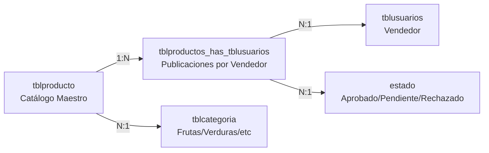
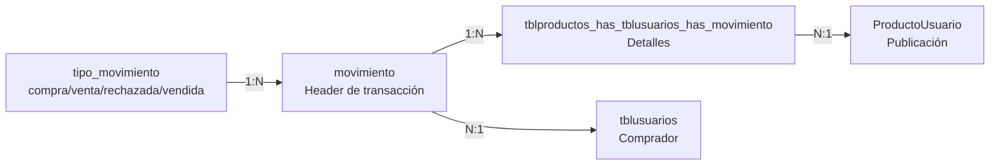
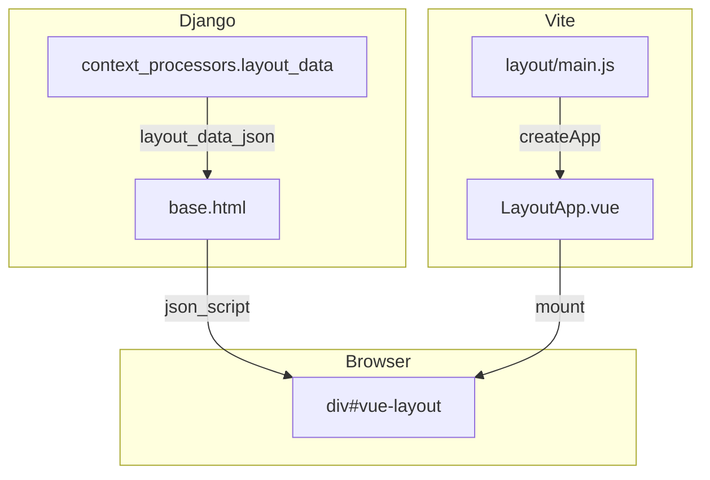
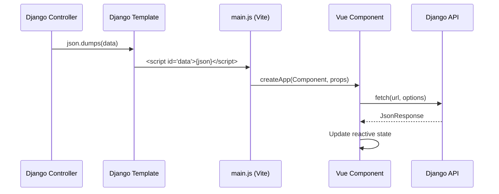

# ARCHITECTURE.md — AgroSFT

> Arquitectura del sistema, módulos, patrones de diseño y decisiones técnicas.  
> **Metodología**: Specification-Driven Development (SDD)
> 
> Archivo adicional: [[design_patterns.puml]] contiene diagramas PlantUML complementarios para los patrones de diseño mencionados.

---

## 1. Vista General de la Arquitectura

```mermaid
graph TB
    subgraph Browser
        LayoutVue[LayoutApp.vue<br/>Navbar + Footer + Toast]
        PageVue[Vue 3 Components<br/>Marketplace, Carrito, etc.]
        Templates[Django Templates<br/>(páginas individuales)]
    end

    subgraph Django App Layer
        CP[context_processors<br/>layout_data]
        URL[URL Router]
        Ctrl[Controllers / Views]
        Forms[Django Forms]
        Svc[Services]
        Repo[Repositories]
    end

    subgraph Infrastructure
        ORM[Django ORM]
        Auth[Auth Backend]
        MW[Middleware]
        Cache[LocMem Cache]
    end

    subgraph External
        MariaDB[(MariaDB 10.4)]
        FS[File System /media]
    end

    CP -->|JSON| LayoutVue
    Templates --> URL
    PageVue -->|AJAX| Ctrl
    URL --> Ctrl
    Ctrl --> Forms
    Ctrl --> Svc
    Svc --> Repo
    Ctrl --> ORM
    Repo --> ORM
    ORM --> MariaDB
    Auth --> MariaDB
    MW --> Ctrl
    Svc --> Cache
    Ctrl --> FS
```

### Capas del Sistema

| Capa | Responsabilidad | Ubicación |
|---|---|---|
| **Layout Vue** | Navbar, footer, notificaciones (3 estados: guest/user/admin) | `frontend/src/layout/LayoutApp.vue` |
| **Presentación** | Templates Django + Componentes Vue por página | `templates/`, `frontend/src/*/` |
| **Context Processor** | Inyecta JSON con datos de layout a Vue | `core/context_processors.py` |
| **Routing** | Mapeo URL → Controller | `config/urls.py`, `apps/*/urls.py` |
| **Controllers** | Orquestación de requests, validación de permisos, renderizado | `apps/*/controllers/` |
| **Forms** | Validación de entrada del usuario | `apps/*/forms/` |
| **Services** | Lógica de negocio reutilizable | `apps/*/services/` |
| **Repositories** | Acceso a datos, queries complejos | `apps/*/repositories/` |
| **Models** | Mapeo ORM a tablas existentes | `apps/*/models/` |
| **Core** | Clases base, middleware, utilidades compartidas | `core/` |

---

## 2. Apps Django

### 2.1 `core` — Framework Base

```
core/
├── controllers/base_controller.py  → BaseController con json_response(), get_request_data()
├── models/base_model.py           → AbstractBaseModel (created_at, updated_at, is_active)
├── models/terminos_model.py       → Fake Manager para términos (sin tabla real)
├── repositories/base_repository.py → GenericRepository (CRUD, paginación, log_action)
├── services/base_service.py       → BaseFieldValidator (validación genérica de campos)
├── utils/helpers.py               → EstadoProducto, EstadoSolicitud, safe_int, safe_decimal
└── middleware.py                  → NoCacheMiddleware (previene caché post-logout)
```

### 2.2 `apps.usuarios` — Gestión de Usuarios

```
apps/usuarios/
├── controllers/
│   ├── auth_controller.py        → RegistroView, LoginView, LogoutView, PerfilView, CambiarPasswordView
│   └── terminos_controller.py    → TerminosView, AceptarTerminosView
├── forms/auth_forms.py           → RegistroForm, LoginForm, PerfilForm, CambiarPasswordForm
├── models/
│   ├── profile_model.py          → Tblusuarios (AUTH_USER_MODEL), UserProfile, UserDevice, UserAddress
│   └── terminos_model.py         → Termino, AceptacionTermino (POJOs sin DB)
├── services/terminos_service.py  → TerminosService (aceptación vía caché)
├── backends.py                   → TblusuariosAuthBackend (autenticación personalizada)
└── pipeline.py                   → create_user_custom (Google OAuth pipeline)
```

**Modelo de Usuario**: `Tblusuarios`
- `USERNAME_FIELD = 'correo'` (correo como identificador único)
- `AUTH_USER_MODEL = 'usuarios.Tblusuarios'`
- Manager: `TblusuariosManager` (create_user, create_superuser)
- Contraseña: campo `contraseña` con `make_password`/`check_password`

### 2.3 `apps.inventario` — Catálogo y Marketplace

```
apps/inventario/
├── controllers/producto_controller.py  → CRUD productos, marketplace, aprobar/rechazar, API stock
├── forms/producto_form.py             → ProductoForm (nombre, descripción, categoría, precio, cantidad)
├── models/producto.py                 → Estado, TipoMovimiento, Categoria, Producto, ProductoUsuario, Calificacion
├── repositories/producto_repository.py → ProductoRepository (queries complejos, soft delete)
└── services/producto_service.py       → Validación de datos de producto
```

**Arquitectura Dual de Productos**:



- **tblproducto**: Catálogo unificado (nombre, descripción, categoría, stock_minimo)
- **tblproductos_has_tblusuarios**: Publicación individual (precio, cantidad, estado, calificación promedio)
- Un mismo producto genérico puede tener múltiples publicaciones de distintos vendedores

### 2.4 `apps.ventas` — Transacciones

```
apps/ventas/
├── controllers/
│   ├── carrito_controller.py       → CRUD carrito + checkout
│   ├── solicitud_controller.py     → Inbox vendedor (aceptar/rechazar/vender)
│   ├── venta_controller.py         → Listado y detalle de ventas
│   └── calificacion_controller.py  → Calificar transacción + historial
├── forms/calificacion_form.py      → Rating 1.0-5.0 pasos de 0.5
├── models/
│   ├── movimiento.py               → TipoMovimiento, Movimiento, ProductoUsuarioMovimiento
│   ├── solicitud.py                → OBSOLETO (SolicitudCompra, DetalleSolicitudCompra)
│   └── venta.py                    → OBSOLETO (Venta, DetalleVenta)
└── services/carrito_service.py     → Carrito basado en sesión
```

**Arquitectura de Movimientos**:



**Convención de cantidades**:
- **Positiva**: Abastecimiento/entrada de stock
- **Negativa**: Venta/salida de stock

**Estados de solicitud por tipo_movimiento**:

| tipo_movimiento | Estado Lógico | Significado |
|---|---|---|
| `compra` | Recibida | Comprador envió solicitud |
| `venta` | Aceptada | Vendedor aceptó |
| `rechazada` | Rechazada | Vendedor rechazó |
| `vendida` | Completada | Transacción finalizada |
| `cancelada` | Cancelada | Venta cancelada (desde estado `venta`) |

### 2.5 `apps.clientes` — Historial

```
apps/clientes/
├── controllers/cliente_controller.py  → Listar clientes, detalle, historial de compras
├── forms/cliente_form.py             → (No utilizado activamente)
└── models/cliente.py                 → Cliente (modelo sin managed=False, no usado)
```

---

## 3. Frontend Architecture

### 3.1 Layout Global en Vue

> Layout estructural migrado a Vue.js. Ver [[DECISIONS#ADR-011]].

El navbar, footer y notificaciones toast se renderizan desde un **único componente Vue** (`LayoutApp.vue`) que recibe datos mediante el context processor `core.context_processors.layout_data`. Este inyecta un JSON con datos del usuario, URLs de navegación, contador del carrito y mensajes flash.



El `LayoutApp.vue` es un componente **no-scoped** que reutiliza las clases CSS de Bootstrap 5 y las variables CSS del proyecto (`frontend/src/style.css`). Los estados se manejan con Vue reactivo (`ref`, `v-if`, `v-for`).

### 3.2 Integración Django + Vue (Componentes de Página)



### 3.3 Entry Points (Vite)

| Entry | Archivo | Componente | Props |
|---|---|---|---|
| `layout` | `frontend/src/layout/main.js` | `LayoutApp.vue` | `user`, `urls`, `cart_count`, `messages` |
| `marketplace` | `frontend/src/marketplace/main.js` | `MarketApp.vue` | `initialProducts`, `categories`, `urls` |
| `carrito` | `frontend/src/carrito/main.js` | `CarritoApp.vue` | `items`, `urls` |
| `inventario` | `frontend/src/inventario/main.js` | `InventarioApp.vue` | `initialProducts`, `categories`, `estados`, `urls` |
| `solicitudes` | `frontend/src/solicitudes/main.js` | `SolicitudApp.vue` | Ninguna (autocontenido) |
| `calificaciones` | `frontend/src/calificaciones/main.js` | `CalificacionApp.vue` | `movimientoDetalle`, `urls` |

### 3.4 Módulo Especial: Solicitudes (JS Puro)

> [!important] Desviación Arquitectónica Documentada
> `SolicitudApp.vue` funciona **sin conexión a base de datos**. Ver [[DECISIONS#ADR-003]].

- No requiere props del servidor
- Carga datos mock locales como fallback
- `main.js` monta sin props: `createApp(SolicitudApp).mount(el)`
- Todas las acciones operan sobre estado Vue reactivo

---

## 4. Middleware

| Middleware | Ubicación | Función |
|---|---|---|
| `SecurityMiddleware` | Django built-in | Headers de seguridad |
| `SessionMiddleware` | Django built-in | Gestión de sesiones |
| `CommonMiddleware` | Django built-in | Normalización de URLs |
| `CsrfViewMiddleware` | Django built-in | Protección CSRF |
| `AuthenticationMiddleware` | Django built-in | Inyección de `request.user` |
| `MessageMiddleware` | Django built-in | Framework de mensajes |
| `XFrameOptionsMiddleware` | Django built-in | Prevención de clickjacking |
| `NoCacheMiddleware` | `core/middleware.py` | Previene caché para usuarios autenticados |

---

## 5. Autenticación

### Backend Personalizado

`TblusuariosAuthBackend` (`apps/usuarios/backends.py`):
- Autentica contra tabla `tblusuarios` usando campo `correo`
- Usa `check_password` de Django para verificar hash
- Retorna instancia de `Tblusuarios`

### Google OAuth2

Configurado vía `social-auth-app-django`:
- Pipeline personalizado: `apps/usuarios/pipeline.py` → `create_user_custom`
- Crea usuarios `Tblusuarios` con campos personalizados
- **Estado**: Configurado pero no activo (credenciales comentadas)

---

## 6. Sesiones y Caché

| Configuración | Valor | Razón |
|---|---|---|
| `SESSION_ENGINE` | `django.contrib.sessions.backends.cache` | Sin tabla de sesiones en BD |
| `SESSION_CACHE_ALIAS` | `default` (LocMemCache) | Caché en memoria |
| `SESSION_EXPIRE_AT_BROWSER_CLOSE` | `True` | Seguridad |
| `SESSION_COOKIE_AGE` | `1800` (30 min) | Timeout de inactividad |

---

## 7. Gestión de Base de Datos

### Principio Fundamental

> [!danger] Regla Absoluta
> **Django NO gestiona el schema de base de datos.**
> - Todos los modelos: `managed = False`
> - `MIGRATION_MODULES = {app: None}` para todas las apps personalizadas
> - El schema se mantiene directamente en MariaDB
> - Los triggers de BD gestionan stock y calificaciones automáticamente

### Trigger Crítico

`trg_actualizar_stock_oferta`: Se ejecuta al insertar en `tblproductos_has_tblusuarios_has_movimiento`.
- Actualiza `cantidad` en `tblproductos_has_tblusuarios`
- Actualiza `calificacion_promedio` si se califica

> **NUNCA** replicar esta lógica en Python.

---

## 8. Patrones de Diseño

| Patrón | Uso | Ejemplo |
|---|---|---|
| **Controller-Service-Repository** | Separación de responsabilidades | Controller → Service → Repository → Model |
| **Template Method** | BaseController con métodos comunes | `json_response()`, `get_request_data()` |
| **Strategy** | Auth backends intercambiables | `TblusuariosAuthBackend`, `GoogleOAuth2` |
| **Proxy** | Models como proxy de tablas externas | Todos los modelos con `managed = False` |
| **Session Facade** | Carrito encapsulado en sesión | `Carrito(request)` |
| **Observer** | Vue reactive state | `ref()`, `computed()`, `watch()` |

> Diagramas PlantUML disponibles en `docs/design_patterns.puml`.

---

## Enlaces Relacionados

- [[PROJECT_CONTEXT]] — Contexto global
- [[DATABASE]] — Modelo de datos detallado
- [[API]] — Endpoints del sistema
- [[DECISIONS]] — Registro de decisiones arquitectónicas
