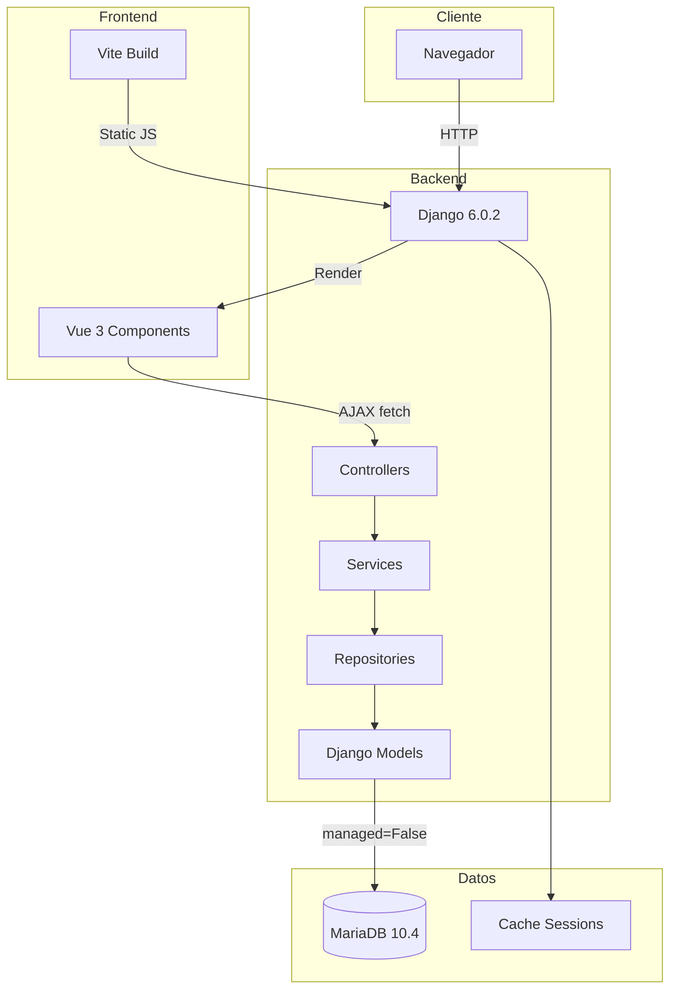
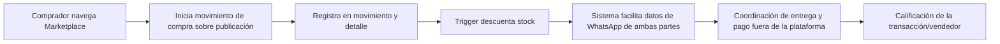
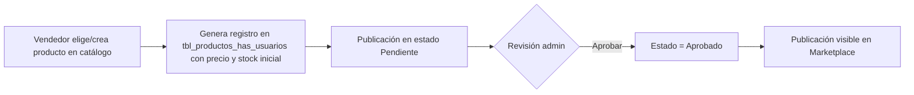

# PROJECT_CONTEXT.md — AgroSFT

> Fuente principal de contexto global del proyecto.  
> **Metodología**: Specification-Driven Development (SDD)  
> **Última actualización**: 2026-06-17

---

## 1. Identidad del Proyecto

| Campo | Valor |
|---|---|
| **Nombre** | AgroSFT — Sistema de Gestión para Pequeños Agricultores |
| **Tipo** | Aplicación web full-stack |
| **Dominio** | Agricultura / Comercio electrónico / Marketplace |
| **Entidad** | SENA — Servicio Nacional de Aprendizaje (Colombia) |
| **Ficha Técnica** | 2988405 |
| **Estado actual** | Desarrollo activo |

---

## 2. Propósito

AgroSFT es una plataforma web diseñada para conectar directamente a pequeños agricultores con compradores finales, eliminando intermediarios en la cadena de comercialización de productos agrícolas.

### Problema que Resuelve

- Los pequeños agricultores colombianos dependen de intermediarios que reducen significativamente sus márgenes de ganancia.
- No existen plataformas accesibles y especializadas para la venta directa de productos agrícolas a nivel local.
- La gestión de inventario y ventas se realiza de forma manual o inexistente.

### Solución Propuesta

Un marketplace digital donde:
- **Agricultores** publican sus productos con precios justos.
- **Compradores** solicitan productos directamente a los productores.
- El sistema gestiona inventario, solicitudes de compra, ventas y calificaciones.

---

## 3. Stack Tecnológico

| Capa | Tecnología | Versión | Rol |
|---|---|---|---|
| **Backend** | Django | 6.0.2 | Framework web principal |
| **Base de Datos** | MariaDB | 10.4 | Persistencia relacional (legacy, no gestionada por Django) |
| **Frontend** | Vue.js | 3.5 | Componentes SPA parciales |
| **Bundler** | Vite | 6.0 | Compilación de assets frontend |
| **CSS** | Bootstrap | 5.1.3 | Framework UI |
| **Iconos** | Font Awesome | 6.4 | Iconografía |
| **Imágenes** | Pillow | 10.2.0 | Procesamiento de imágenes |
| **OAuth** | social-auth-app-django | — | Google OAuth2 (configurado, no activo) |
| **Servidor** | Django runserver | — | Desarrollo |

---

## 4. Arquitectura de Alto Nivel

### Patrón Arquitectónico

**Controller-Service-Repository** adaptado sobre Django:

- **Controller** (Vistas Django): Reciben requests, validan permisos, orquestan lógica, retornan responses.
- **Service**: Lógica de negocio reutilizable, validaciones complejas.
- **Repository**: Acceso a datos, queries complejos, operaciones CRUD genéricas.
- **Model** (Django ORM): Mapeo a tablas existentes con `managed = False`.

---

## 5. Módulos del Sistema

| Módulo | App Django | Descripción | Estado |
|---|---|---|---|
| **Usuarios** | `apps.usuarios` | Autenticación, registro, perfil, términos | ✅ Funcional |
| **Inventario** | `apps.inventario` | Catálogo de productos, CRUD, marketplace | ✅ Funcional |
| **Ventas** | `apps.ventas` | Carrito, solicitudes, ventas, calificaciones | ✅ Funcional |
| **Clientes** | `apps.clientes` | Historial de compradores | ✅ Funcional |
| **Core** | `core` | Clases base, middleware, utilidades | ✅ Funcional |
| **Frontend** | `frontend/src/` | 5 componentes Vue 3 | ✅ Funcional |

---

## 6. Reglas de Oro del Proyecto

> [!danger] Reglas Críticas — Viola estas reglas y el sistema fallará

1. **`managed = False` en TODOS los modelos** — Django NUNCA crea ni modifica tablas. El schema se gestiona externamente en MariaDB.
2. **`MIGRATION_MODULES = {app: None}`** — No hay migraciones Django para las apps personalizadas.
3. **Triggers de BD para stock** — El trigger `trg_actualizar_stock_oferta` actualiza stock automáticamente. **NUNCA** restar stock manualmente en Python.
4. **Cantidad negativa** — En `ProductoUsuarioMovimiento`, la cantidad es negativa para ventas/compras y positiva para abastecimiento.
5. **Sesiones en caché** — Las sesiones no usan base de datos; se almacenan en `LocMemCache`.

---

## 7. Usuarios y Roles

| Rol | Descripción | Permisos Clave |
|---|---|---|
| **Admin** | Administrador del sistema | Aprobar/rechazar productos, acceso total |
| **Agricultor/Vendedor** | Productor que publica productos | CRUD productos propios, gestionar solicitudes recibidas |
| **Comprador** | Usuario que compra productos | Navegar marketplace, agregar al carrito, crear solicitudes |

> [!note] Nota sobre roles
> El campo `rol` no existe en la tabla `tblusuarios`. Los roles se determinan por `is_staff`/`is_superuser` y por contexto (vendedor = dueño de producto, comprador = creador de movimiento).

---

## 8. Flujos Principales

### 8.1 Flujo de Compra

### 8.2 Flujo de Publicación

---

## 9. Convenciones de Documentación

Esta base de conocimiento sigue el estándar **SDD (Specification-Driven Development)**:

| Documento | Propósito |
|---|---|
| [[REQUIREMENTS]] | Requisitos funcionales y no funcionales |
| [[USER_STORIES]] | Historias de usuario y criterios de aceptación |
| [[ARCHITECTURE]] | Arquitectura detallada, módulos, patrones |
| [[DATABASE]] | Modelo de datos completo |
| [[API]] | Contratos de endpoints |
| [[ROADMAP]] | Planificación y evolución |
| [[DECISIONS]] | Registro de decisiones técnicas (ADR) |
| [[CHANGELOG]] | Historial cronológico de cambios |

---

## 10. Contacto y Contexto SENA

| Campo | Valor |
|---|---|
| **Programa de Formación** | Análisis y Desarrollo de Sistemas de Información |
| **Centro** | SENA Regional |
| **Competencia** | Desarrollar sistemas de información de acuerdo con los requerimientos |
| **Ficha** | 2988405 |

---

## Enlaces Relacionados

- [[00-INDEX]] — Navegación general
- [[REQUIREMENTS]] — Requisitos del sistema
- [[ARCHITECTURE]] — Arquitectura detallada
- [[ROADMAP]] — Plan de evolución
