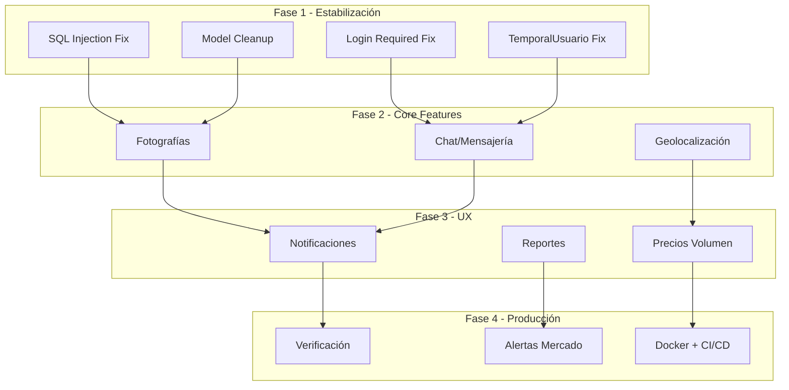

# ROADMAP.md — AgroSFT

> Planificación y evolución futura del sistema.  
> Basado en brechas identificadas entre la implementación actual y la ficha SENA.

---

## Estado Actual

| Módulo | Cobertura | Funcionalidades |
|---|---|---|
| Usuarios | 85% | Auth, perfil, términos, OAuth (config) |
| Inventario | 90% | CRUD, marketplace, aprobación, filtros |
| Ventas | 80% | Carrito, solicitudes, ventas, calificaciones |
| Clientes | 70% | Listado, historial básico |
| **Brechas críticas** | 0% | Chat, fotos, geolocalización, notificaciones |

---

## Fases de Evolución

### Fase 1: Estabilización y Seguridad (Actual)

**Objetivo**: Corregir problemas técnicos y asegurar la base.

| Tarea | Prioridad | Complejidad | Estado |
|---|---|---|---|
| Corregir SQL injection en `tabla_existe()` y `columna_existe()` | Crítica | Baja | ❌ Pendiente |
| Agregar `@login_required` a vistas de carrito | Alta | Baja | ❌ Pendiente |
| Eliminar clase `TemporalUsuario` (check_password always True) | Alta | Baja | ❌ Pendiente |
| Consolidar modelo duplicado `TipoMovimiento` | Media | Media | ❌ Pendiente |
| Eliminar modelos obsoletos (`SolicitudCompra`, `Venta`) | Media | Baja | ❌ Pendiente |
| Completar password reset (backend real con email) | Media | Media | ❌ Pendiente |
| Agregar `managed = False` a modelo `Cliente` | Media | Baja | ❌ Pendiente |

---

### Fase 2: Funcionalidades Core Faltantes

**Objetivo**: Implementar las funcionalidades críticas de la ficha SENA.

#### 2.1 Fotografías de Productos (GAP-02)

| Aspecto | Detalle |
|---|---|
| **Prioridad** | Alta |
| **Complejidad** | Media |
| **Impacto** | Mejora la experiencia de compra significativamente |

**Especificación**:
- Agregar campo `imagen` en `ProductoUsuario` o nueva tabla `producto_imagen`
- Upload con Pillow para compresión automática
- Galería de hasta 5 imágenes por producto
- Thumbnail en cards del marketplace
- Vista ampliada en detalle de producto

#### 2.2 Chat/Mensajería (GAP-01)

| Aspecto | Detalle |
|---|---|
| **Prioridad** | Alta |
| **Complejidad** | Alta |
| **Impacto** | Comunicación directa comprador-vendedor |

**Especificación**:
- Nuevo módulo `apps.mensajeria`
- Tabla `mensaje`: emisor, receptor, contenido, timestamp, leído
- WebSockets con Django Channels (o polling AJAX como alternativa)
- Componente Vue `ChatApp.vue`
- Notificación de nuevos mensajes

#### 2.3 Geolocalización (GAP-03)

| Aspecto | Detalle |
|---|---|
| **Prioridad** | Media |
| **Complejidad** | Media |
| **Impacto** | Permite buscar productos por ubicación |

**Especificación**:
- Campos latitud/longitud en `UserProfile` o `tblproducto`
- Mapa interactivo con Leaflet.js
- Filtro de radio de búsqueda
- Visualización de agricultores en mapa

---

### Fase 3: Mejoras de Experiencia

#### 3.1 Notificaciones Push (GAP-04)

| Aspecto | Detalle |
|---|---|
| **Prioridad** | Media |
| **Complejidad** | Alta |
| **Impacto** | Alertas en tiempo real para solicitudes |

**Especificación**:
- Sistema de notificaciones in-app
- Web Push con Service Workers
- Email notifications para eventos clave

#### 3.2 Precios por Volumen (GAP-05)

| Aspecto | Detalle |
|---|---|
| **Prioridad** | Media |
| **Complejidad** | Media |
| **Impacto** | Incentiva compras mayores |

**Especificación**:
- Tabla `precio_volumen`: producto_usuario, cantidad_min, precio_descuento
- UI para configurar rangos de precio
- Cálculo automático en carrito

#### 3.3 Reportes y Estadísticas (GAP-08)

| Aspecto | Detalle |
|---|---|
| **Prioridad** | Baja |
| **Complejidad** | Media |
| **Impacto** | Visibilidad del negocio para agricultores |

**Especificación**:
- Dashboard con gráficas (Chart.js)
- Ventas por período, productos más vendidos
- Exportar a PDF/Excel

---

### Fase 4: Escalamiento y Producción

#### 4.1 Verificación de Agricultores (GAP-06)

- Proceso de verificación de identidad
- Badge de "Agricultor Verificado"
- Documentos de soporte

#### 4.2 Alertas de Mercado (GAP-07)

- Monitoreo de precios del mercado
- Alertas de variación de precios
- Tendencias de disponibilidad

#### 4.3 Preparación para Producción

| Tarea | Descripción |
|---|---|
| Migrar a PostgreSQL/MySQL 8 | Mejor soporte que MariaDB 10.4 |
| Redis como cache backend | Reemplazar LocMemCache |
| Gunicorn + Nginx | Servidor de producción |
| Docker containerization | Despliegue consistente |
| CI/CD pipeline | Testing automático |
| Test suite completo | Cobertura de código |

---

## Priorización Visual

---

## Enlaces Relacionados

- [[PROJECT_CONTEXT]] — Contexto global del proyecto
- [[REQUIREMENTS]] — Requisitos implementados y pendientes
- [[DECISIONS]] — Decisiones técnicas registradas
- [[CHANGELOG]] — Historial de cambios realizados
