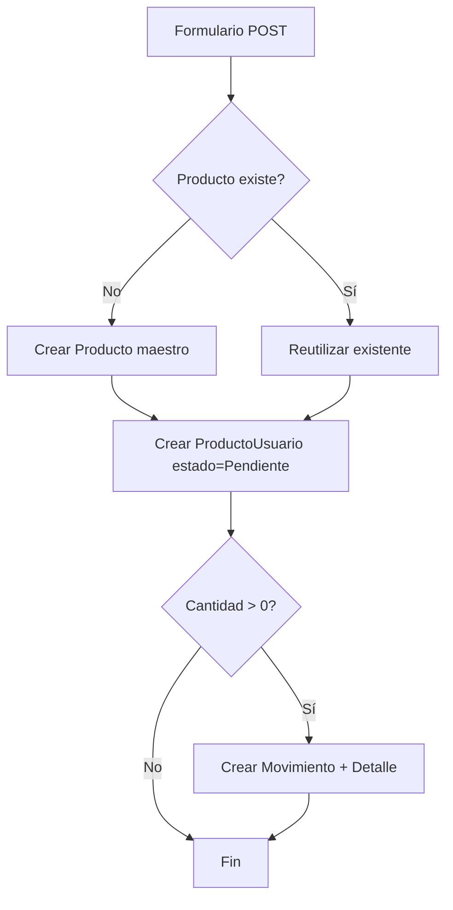

# USER_STORIES.md — AgroSFT

> Historias de usuario y criterios de aceptación.  
> Derivadas de [[REQUIREMENTS]] y análisis de código existente.  
> **Formato**: `Como [rol], quiero [acción], para [beneficio]`

---

## Épica 1: Gestión de Usuarios

### US-01: Registro de Usuario

**Como** visitante no registrado,  
**quiero** crear una cuenta con mis datos personales,  
**para** poder acceder al sistema y publicar/comprar productos.

**Requisitos relacionados**: [[REQUIREMENTS#RF-U01]]

**Criterios de Aceptación**:
- [x] Formulario solicita: nombres, apellidos, correo, teléfono, contraseña
- [x] Correo debe ser único en el sistema
- [x] Contraseña mínima de 8 caracteres
- [x] Al registrarse exitosamente, redirige al login
- [x] Mensaje de confirmación visible
- [x] Validación de formato de correo electrónico

**Implementación**: `apps/usuarios/controllers/auth_controller.py` → `RegistroView`  
**Template**: `templates/usuarios/registro.html`

---

### US-02: Inicio de Sesión

**Como** usuario registrado,  
**quiero** autenticarme con correo y contraseña,  
**para** acceder a las funcionalidades del sistema.

**Requisitos relacionados**: [[REQUIREMENTS#RF-U02]]

**Criterios de Aceptación**:
- [x] Formulario solicita correo y contraseña
- [x] Credenciales inválidas muestran mensaje de error
- [x] Usuario inactivo no puede iniciar sesión
- [x] Redirige al marketplace tras login exitoso
- [x] Soporte para parámetro `?next=` para redirección personalizada

**Implementación**: `apps/usuarios/controllers/auth_controller.py` → `LoginView`  
**Template**: `templates/usuarios/login.html`

---

### US-03: Cerrar Sesión

**Como** usuario autenticado,  
**quiero** cerrar sesión de forma segura,  
**para** proteger mi cuenta en dispositivos compartidos.

**Requisitos relacionados**: [[REQUIREMENTS#RF-U03]]

**Criterios de Aceptación**:
- [x] Cierra la sesión activa del usuario
- [x] Limpia datos de sesión
- [x] Redirige al login
- [x] Previene acceso a páginas protegidas tras cerrar sesión (NoCacheMiddleware)
- [x] Soporta tanto GET como POST

**Implementación**: `apps/usuarios/controllers/auth_controller.py` → `LogoutView`

---

### US-04: Editar Perfil

**Como** usuario autenticado,  
**quiero** ver y editar mi información de perfil,  
**para** mantener mis datos actualizados.

**Requisitos relacionados**: [[REQUIREMENTS#RF-U04]], [[REQUIREMENTS#RF-U09]]

**Criterios de Aceptación**:
- [x] Muestra nombres, apellidos, correo, teléfono
- [x] Permite actualizar datos personales
- [x] Permite subir imagen de perfil
- [x] Permite eliminar imagen de perfil
- [x] Responde tanto a requests normales como AJAX

**Implementación**: `apps/usuarios/controllers/auth_controller.py` → `PerfilView`  
**Template**: `templates/usuarios/perfil.html`

---

## Épica 2: Gestión de Inventario

### US-05: Publicar Producto

**Como** agricultor,  
**quiero** publicar un nuevo producto con precio y cantidad,  
**para** que otros usuarios puedan verlo y comprarlo.

**Requisitos relacionados**: [[REQUIREMENTS#RF-I01]], [[REQUIREMENTS#RF-I12]]

**Criterios de Aceptación**:
- [x] Formulario solicita: nombre, descripción, categoría, precio, cantidad, stock mínimo
- [x] Si el producto ya existe en el catálogo, reutiliza el registro maestro
- [x] Crea relación ProductoUsuario con estado "Pendiente"
- [x] Si cantidad > 0, registra movimiento inicial de stock
- [x] Redirige a Mi Inventario tras creación exitosa

**Implementación**: `apps/inventario/controllers/producto_controller.py` → `crear_producto()`

---

### US-06: Ver Mi Inventario

**Como** agricultor,  
**quiero** ver la lista de mis productos publicados,  
**para** gestionar mi oferta.

**Requisitos relacionados**: [[REQUIREMENTS#RF-I02]], [[REQUIREMENTS#RF-I11]]

**Criterios de Aceptación**:
- [x] Lista SOLO productos del usuario actual
- [x] Muestra nombre, precio, stock, estado, categoría
- [x] Botones de editar y eliminar por producto
- [x] Búsqueda por nombre
- [x] Filtro por categoría
- [x] Paginación de 10 productos por página
- [x] Componente Vue `InventarioApp.vue` para interactividad

**Implementación**: `apps/inventario/controllers/producto_controller.py` → `listar_productos()`  
**Frontend**: `frontend/src/inventario/InventarioApp.vue`

---

### US-07: Editar Producto

**Como** agricultor,  
**quiero** modificar los datos de mi producto,  
**para** actualizar precio, stock o estado.

**Requisitos relacionados**: [[REQUIREMENTS#RF-I03]]

**Criterios de Aceptación**:
- [x] Solo el dueño o admin puede editar
- [x] Formulario precargado con datos actuales
- [x] Si cambia la cantidad, registra movimiento de diferencia de stock
- [x] No actualiza stock directamente (lo hace el trigger de BD)
- [x] Admin puede cambiar stock_minimo

**Implementación**: `apps/inventario/controllers/producto_controller.py` → `editar_producto()`

---

### US-08: Marketplace

**Como** comprador,  
**quiero** navegar por productos disponibles de otros agricultores,  
**para** seleccionar los que quiero comprar.

**Requisitos relacionados**: [[REQUIREMENTS#RF-I05]], [[REQUIREMENTS#RF-I10]]

**Criterios de Aceptación**:
- [x] Muestra SOLO productos de OTROS usuarios con estado "Aprobado"
- [x] Excluye productos del usuario actual
- [x] Muestra nombre, precio, stock, vendedor, categoría
- [x] Botón "Agregar al carrito" por producto
- [x] Búsqueda, filtros, ordenamiento
- [x] Paginación de 12 productos por página
- [x] Componente Vue `MarketApp.vue` para interactividad

**Implementación**: `apps/inventario/controllers/producto_controller.py` → `marketplace()`  
**Frontend**: `frontend/src/marketplace/MarketApp.vue`

---

## Épica 3: Proceso de Compra

### US-09: Carrito de Compras

**Como** comprador,  
**quiero** agregar productos a un carrito y gestionarlos,  
**para** preparar mi solicitud de compra.

**Requisitos relacionados**: [[REQUIREMENTS#RF-V01]], [[REQUIREMENTS#RF-V02]], [[REQUIREMENTS#RF-V03]], [[REQUIREMENTS#RF-V04]]

**Criterios de Aceptación**:
- [x] Agregar producto con validación de stock
- [x] Cambiar cantidad con controles +/-
- [x] Eliminar productos individuales
- [x] Calcular total automáticamente
- [x] Persiste en sesión (sobrevive recargas, no DB)
- [x] Componente Vue `CarritoApp.vue`

**Implementación**: `apps/ventas/services/carrito_service.py`  
**Frontend**: `frontend/src/carrito/CarritoApp.vue`

---

### US-10: Crear Solicitud de Compra

**Como** comprador,  
**quiero** enviar una solicitud de compra al vendedor,  
**para** iniciar el proceso de transacción.

**Requisitos relacionados**: [[REQUIREMENTS#RF-V06]]

**Criterios de Aceptación**:
- [x] Checkout crea Movimiento de tipo "compra"
- [x] Crea ProductoUsuarioMovimiento por cada item con la cantidad
- [x] Trigger de BD descuenta stock automáticamente al registrar el movimiento de "compra"
- [x] Limpia el carrito tras checkout exitoso
- [x] Redirige a vista de solicitudes

**Implementación**: `apps/ventas/controllers/carrito_controller.py` → `checkout_carrito()`

---

### US-11: Gestionar Solicitudes (Vendedor)

**Como** vendedor,  
**quiero** ver, aceptar o rechazar solicitudes de compra sobre mis productos,  
**para** decidir qué transacciones completar.

**Requisitos relacionados**: [[REQUIREMENTS#RF-V07]], [[REQUIREMENTS#RF-V08]], [[REQUIREMENTS#RF-V09]], [[REQUIREMENTS#RF-V10]]

**Criterios de Aceptación**:
- [x] Lista solicitudes de compra ("compra") sobre MIS productos
- [x] Muestra datos del comprador (nombre, email, teléfono) y facilita contacto por WhatsApp
- [x] Coordinación de la entrega y el pago fuera de la plataforma
- [x] Frontend funcional y notificaciones para feedback
- [x] Permite proceder a calificar la transacción/vendedor después

**Implementación**: `apps/ventas/controllers/solicitud_controller.py`  
**Frontend**: `frontend/src/solicitudes/SolicitudApp.vue`

---

### US-12: Calificar Transacción

**Como** comprador/vendedor,  
**quiero** calificar una transacción completada,  
**para** generar reputación del vendedor.

**Requisitos relacionados**: [[REQUIREMENTS#RF-V13]]

**Criterios de Aceptación**:
- [x] Calificación de 1.0 a 5.0 en pasos de 0.5
- [x] Solo puede calificar si participó en la transacción
- [x] Solo puede calificar una vez por transacción
- [x] Estrellas interactivas con hover (Vue)
- [x] Trigger de BD actualiza calificacion_promedio en ProductoUsuario

**Implementación**: `apps/ventas/controllers/calificacion_controller.py`  
**Frontend**: `frontend/src/calificaciones/CalificacionApp.vue`

---

## Épica 4: Historial de Clientes

### US-13: Ver Historial de Clientes

**Como** vendedor,  
**quiero** ver el historial de compradores que han interactuado con mis productos,  
**para** conocer mi base de clientes.

**Requisitos relacionados**: [[REQUIREMENTS#RF-C01]], [[REQUIREMENTS#RF-C02]]

**Criterios de Aceptación**:
- [x] Lista usuarios con movimientos de compra/venta
- [x] Muestra estadísticas: total movimientos, compras, ventas
- [x] Ordenados por actividad (más activos primero)
- [x] Detalle de cliente con historial de movimientos

**Implementación**: `apps/clientes/controllers/cliente_controller.py`

---

## Resumen de Historias por Estado

| Estado | Cantidad | Historias |
|---|---|---|
| ✅ Completadas | 13 | US-01 a US-13 |
| 🔶 Parciales | 2 | RF-U08 (password reset), RF-I13 (stock alerts) |
| ❌ No iniciadas | 8 | GAP-01 a GAP-08 (ver [[REQUIREMENTS#3. Requisitos Pendientes]]) |

---

## Enlaces Relacionados

- [[PROJECT_CONTEXT]] — Contexto global del proyecto
- [[REQUIREMENTS]] — Requisitos funcionales y no funcionales
- [[ARCHITECTURE]] — Cómo los módulos implementan estas historias
- [[API]] — Endpoints que soportan estas historias
